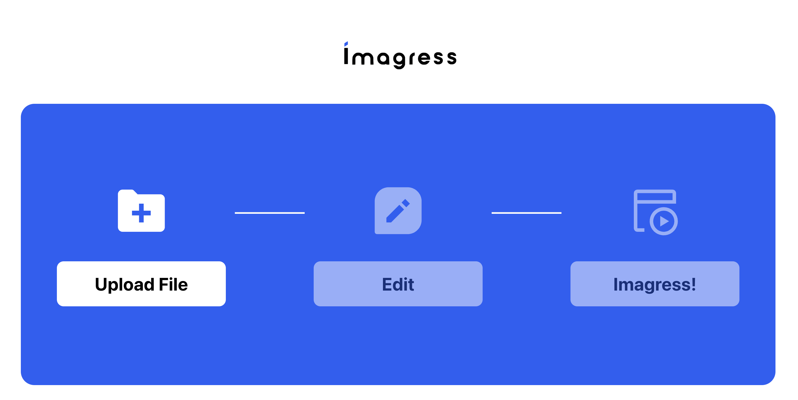

# Imagress Frontend

This project implement an website for convert or/and process image in batch. It's implemented with `create-react-app` and used an API from [Imagress Server](https://github.com/Imagress/imagress-server).


---

## Playground

### Website [https://www.imagress.com](https://www.imagress.com)



### API [https://api.imagress.com](https://api.imagress.com)

### API Docs [https://api.imagress.com/redoc](https://api.imagress.com/redoc)

---

## To run locally

### Clone this project:

```bash
git clone https://github.com/Imagress/imagress-frontend.git
```

### Install dependency:

```bash
npm install
# or
yarn
```

### Run the development server:

```bash
npm start
# or
yarn start
```

Runs the app in the development mode.\
Open [http://localhost:3000](http://localhost:3000) to view it in your browser.

The page will reload when you make changes.\
You may also see any lint errors in the console.

### Run E2E test (Playwright)

```bash
# run test
npx playwright test
# View report html
npx playwright show-report
```
